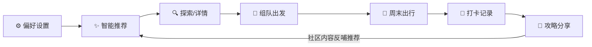
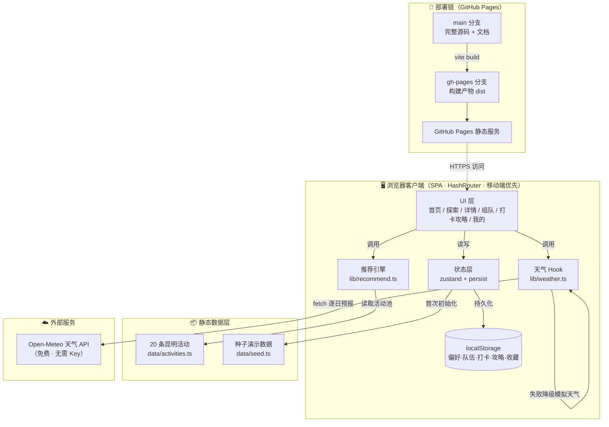

# 🗺️ 周末城市探索指南

> 大学生的周末决策助手 —— 根据你的**兴趣偏好、实时天气、预算与同行人数**，智能推荐本地活动，并支持**组队出发 → 打卡记录 → 攻略分享**的完整闭环。

**🔗 在线体验：<https://zzzgl-star.github.io/weekend-city-guide/>**


---

## 1. 项目背景

大学生周末常纠结"去哪玩"：展览、市集、演出、短途徒步等活动信息分散在不同平台，且决策受**天气、预算、同行人数**影响很大。看到活动后找不到人一起去、玩完没有记录、攻略难以沉淀——缺少一个完整闭环。

**本项目以昆明为演示城市**，内置 20 条真实场景活动数据（省博特展、翠湖市集、西山徒步、MAO Livehouse、斗南花市、大学城飞盘局……），完整解决"选→约→玩→记→享"五步需求。

## 2. 功能特性

| 模块 | 能力说明 |
|---|---|
| ✨ 智能推荐 | 五维加权评分（兴趣 35% · 天气 25% · 预算 20% · 距离 10% · 热度 10%），预算/半径硬过滤，自动生成中文推荐理由 |
| 🌤️ 天气感知 | 对接 Open-Meteo 实时预报（免费无 Key），自动定位本周末周六/周日；请求失败自动降级为模拟数据，页面永不白屏 |
| 🔍 活动探索 | 类型 / 室内外 / 免费 / 3km 内 / 预算滑块多维筛选，智能推荐·价格·距离·热度四种排序 |
| 📄 活动详情 | 天气适宜度评分、交通指引、装备贴士、同类活动队伍聚合 |
| 🤝 组队出发 | 发起/加入/退出队伍，人数上限控制；**联系方式隐私保护**——加入队伍后才可见 |
| 📸 打卡记录 | 照片上传（前端 Canvas 压缩至 1000px/JPEG70，防 localStorage 超限）、五星评分、短评 |
| 🖼️ 足迹海报 | html2canvas 一键生成"周末足迹"专属海报并保存 PNG |
| 📝 攻略分享 | 图文攻略发布、标签、点赞、关联活动 |
| 👤 个人中心 | 头像昵称、兴趣偏好、预算/同行人数/出行半径滑块，探索积分与四枚徽章 |
| 💾 数据持久化 | zustand persist 中间件同步 localStorage，刷新/关闭浏览器不丢失，支持一键重置演示数据 |

## 3. 产品闭环



## 4. 系统架构图



## 5. 推荐算法

**硬过滤**（不满足直接剔除）：

```text
人均价格 ≤ 预算上限        距市中心 ≤ 出行半径 × 1.5
```

**软评分**（0–100 加权求和，首页 Top3 + 周末逐时段行程均基于此）：

```text
score = 35 × 兴趣匹配        （命中偏好类型 = 1，否则 0.3）
      + 25 × 天气适宜        （室内×雨天 = 1.0；户外×晴 = 1.0；错配 = 0.15~0.6）
      + 20 × 预算匹配        （免费 = 1.0，随价格线性衰减）
      + 10 × 距离匹配        （1 - 距离/半径）
      + 10 × 热度            （popularity / 100）
```

| 天气场景 | 推荐策略 |
|---|---|
| ☔ 雨天 | 室内活动加权（展览、桌游、咖啡、话剧） |
| ☀️ 晴天 | 户外活动加权（徒步、市集、骑行、飞盘） |
| 🌤️ 一晴一雨 | 行程自动"户外+室内"各排一天 |

**推荐理由生成**（模板引擎）：拼接天气场景 + 兴趣命中 + 价格 + 距离 + 组队热度，
例：*"周六多云，户外正好 · 匹配你的「徒步」偏好 · 人均 30 元 · 距市中心 15km · 已有 4 人组队"*

## 6. 项目结构

```text
weekend-city-guide/
├── index.html                  # 入口 HTML（含 meta / favicon）
├── vite.config.ts              # Vite 配置（base=/weekend-city-guide/）
├── tailwind.config.js          # Tailwind 主题（主色 emerald/teal）
├── package.json
├── src/
│   ├── main.tsx                # React 挂载入口
│   ├── App.tsx                 # HashRouter 路由表（8 条路由）
│   ├── index.css               # Tailwind 指令 + 全局样式/动画
│   ├── types.ts                # 领域类型（Activity/Team/Checkin/Guide…）
│   ├── data/
│   │   ├── activities.ts       # 20 条昆明活动 mock + 枚举常量
│   │   └── seed.ts             # 首次访问的种子队伍/打卡/攻略
│   ├── lib/
│   │   ├── recommend.ts        # 五维推荐引擎 + 周末行程规划
│   │   └── weather.ts          # Open-Meteo 接入 + 降级 + 周末日期计算
│   ├── store/
│   │   └── useStore.ts         # zustand 全局状态（persist 到 localStorage）
│   ├── components/
│   │   ├── Layout.tsx          # 布局 + 底部五 Tab 导航
│   │   ├── WeatherCard.tsx     # 周末天气卡（周六/周日）
│   │   ├── ActivityCard.tsx    # 活动卡片（含推荐理由）
│   │   ├── TeamCard.tsx        # 队伍卡片（隐私联系方式）
│   │   └── PosterModal.tsx     # 足迹海报（html2canvas 导出 PNG）
│   └── pages/
│       ├── Home.tsx            # 首页：天气+行程+推荐+社区动态
│       ├── Explore.tsx         # 探索：多维筛选 + 排序
│       ├── ActivityDetail.tsx  # 详情：天气适宜度+组队+打卡+收藏
│       ├── Teams.tsx           # 组队：全部/我的 + 发起表单
│       ├── CheckinPage.tsx     # 打卡足迹 / 攻略分享（分段切换）
│       ├── CheckinForm.tsx     # 打卡表单：照片压缩+评分+短评
│       ├── GuideNew.tsx        # 攻略发布表单
│       └── Profile.tsx         # 个人中心：偏好+积分徽章
├── deploy-api.ps1              # 部署脚本：dist → gh-pages 分支（Contents API）
└── push-source.ps1             # 源码推送脚本：本地 → main 分支（Git Data API）
```

## 7. 数据模型

```typescript
interface Activity {          // 活动（静态 mock）
  id: string; title: string; type: '展览'|'市集'|'演出'|'徒步'|'运动'|'桌游'|'咖啡'|'手作'
  venue: string; address: string
  slots: Slot[]               // sat_am/sat_pm/sat_eve/sun_am/sun_pm/sun_eve
  price: number; indoor: boolean; distanceKm: number; popularity: number
  tags: string[]; description: string; transport: string; tips: string
}
interface Team      { id, activityId, meetSlot, meetPoint, note, maxMembers, creator, members[], contact, createdAt }
interface Checkin   { id, activityId, rating(1-5), note, photo?(dataURL), author, createdAt }
interface Guide     { id, title, content, tags[], activityId?, author, likes, likedByMe, createdAt }
interface UserProfile { nickname, avatar, city, interests[], budget, groupSize, radiusKm }
```

## 8. 本地开发

```bash
# 环境要求：Node.js ≥ 18
npm install          # 安装依赖
npm run dev          # 本地开发 http://localhost:5173
npm run build        # 类型检查 + 生产构建（输出 dist/）
npm run preview      # 本地预览构建产物
```

> 数据全部存在浏览器 localStorage，首次打开自动注入演示数据；「我的 → 重置演示数据」可随时还原。

## 9. 部署方案

采用 **GitHub Pages 双分支**架构，域名长期稳定：

| 分支 | 内容 | 作用 |
|---|---|---|
| `main` | 完整源码 + 文档 | 仓库门面、在线入口 |
| `gh-pages` | `vite build` 产物 | Pages 静态服务源，启用「Deploy from branch」 |

更新线上 = 本地 `npm run build` 后，通过 `deploy-api.ps1` 将 `dist/` 推送到 `gh-pages` 分支（走 GitHub Contents API），约 1 分钟后自动生效，**域名始终为** `https://zzzgl-star.github.io/weekend-city-guide/`。

## 10. 功能演示

1. **首页** → 看周末天气卡与"你的周末行程"（上午/下午/晚间自动排程），注意每条推荐都带理由
2. **探索** → 点"室内 + 免费"筛选，切换"价格最低"排序
3. **详情** → 查看天气适宜度评分、交通贴士 → 点"发起组队"建一支队伍
4. **组队** → 加入别人的队伍 → 观察联系方式从 🔒 变为可见（隐私设计）
5. **打卡** → 上传照片打分写短评 → 点"生成足迹海报"保存 PNG
6. **攻略** → 发布一篇带标签的攻略并点赞
7. **我的** → 修改兴趣（如勾选"演出"）→ 回首页看推荐列表实时变化 → 查看积分徽章

## 11. 技术选型说明

| 选型 | 理由 |
|---|---|
| Vite + React 18 + TS | 秒级热更、类型安全、生态成熟 |
| Tailwind CSS 3.4 | 移动端优先原子样式，快速产出一致 UI |
| zustand + persist | 轻量状态管理，localStorage 持久化开箱即用 |
| HashRouter | 静态托管下刷新 404 免配置，任何 Pages/CDN 均可用 |
| Open-Meteo | 免费无 Key 天气 API + 前端降级兜底 |
| html2canvas | 前端生成分享海报，无需后端 |
| 纯前端 + mock 数据 | 零后端成本、部署极简，后续可平滑升级 Supabase |

## 12. Roadmap

- [ ] 接入 Supabase：真实多用户、云端组队与攻略
- [ ] AI 推荐：LLM 生成个性化周末行程文案
- [ ] Leaflet 地图模式：活动地图分布与足迹热力
- [ ] 更多城市数据包（北京/上海）

---

作者：王明珠（昆明理工大学 · 数据科学与大数据技术）

